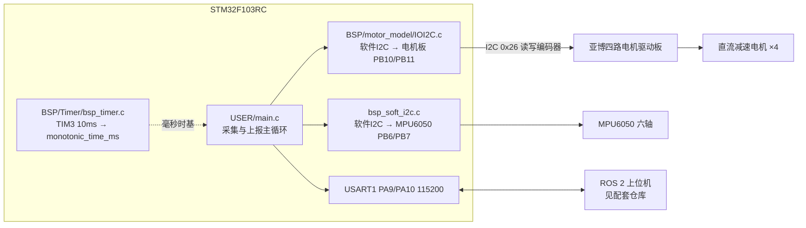
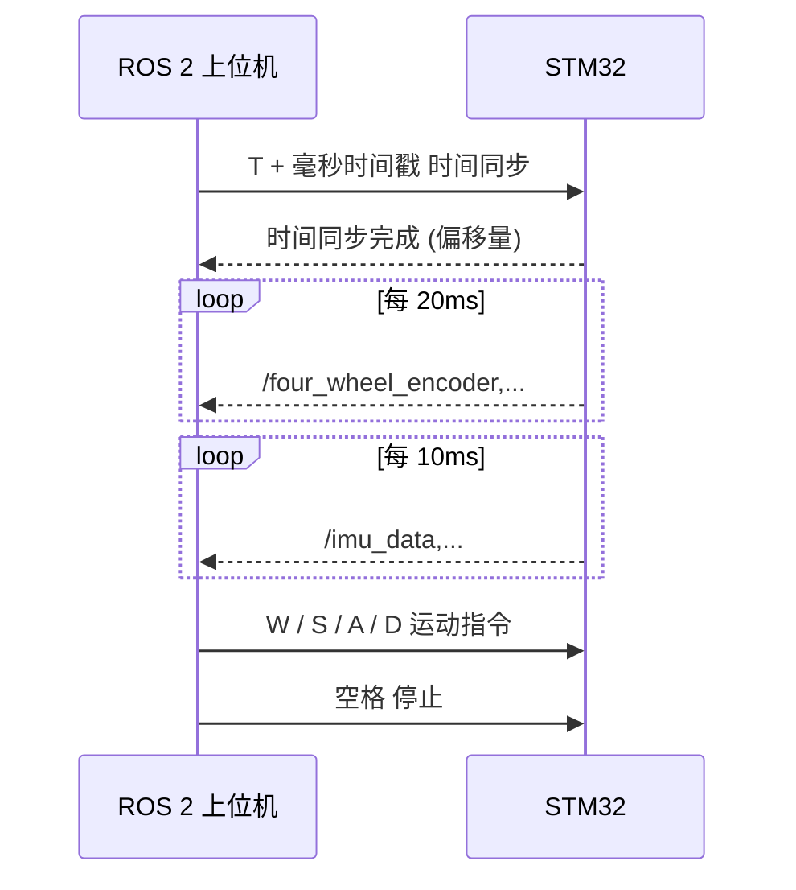
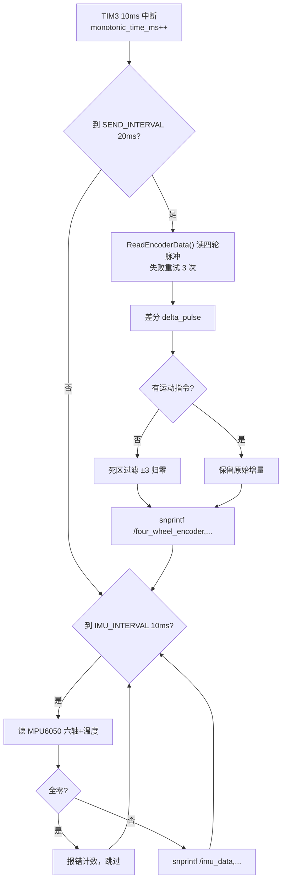

# STM32 Robot Base Chassis Firmware

> **项目背景**：本科毕业设计《基于激光雷达点云数据的地图构建》的**底层驱动子系统**。
> 本固件运行于 STM32，负责移动机器人的运动控制、传感器采集（IMU + 四轮编码器），
> 以及与 ROS 2 上位机的**时钟同步与串口通讯**。

---

## 目录

- [硬件架构](#硬件架构)
- [核心特性](#核心特性)
- [通信协议](#通信协议)
- [数据处理逻辑](#数据处理逻辑)
- [项目工具](#项目工具)
- [快速开始](#快速开始)
- [配套仓库](#配套仓库)
- [归属与许可证](#归属与许可证)

---

## 硬件架构



| 项 | 值 | 依据 |
|---|---|---|
| 主控 | **STM32F103RC**（ARM Cortex-M3） | `USER/I2C.uvprojx` 中 `<Device>STM32F103RC` |
| 开发环境 | Keil uVision | `I2C.uvprojx` / `I2C.uvoptx` |
| IMU | MPU6050（六轴加速度计 + 陀螺仪），软件 I2C，PB6 / PB7 | `mpu6050.c`、`bsp_soft_i2c.c` |
| 里程计 | 四路编码器，经电机驱动板 I2C 读取（从机 `0x26`，PB10 / PB11） | `BSP/motor_model/` |
| 执行器 | 直流减速电机 ×4，四轮差速 | `bsp_motor_iic.c` |
| 上位机接口 | USART1，115200，ASCII 文本 | `USER/main.c` |

> 上位机（ROS 2 侧）与激光雷达不在此仓库内，见 [配套仓库](#配套仓库)。

---

## 核心特性

以下均对应 `USER/main.c` 中的实际实现。

### 1. 智能死区过滤（抑制静止时的地图漂移）

在无运动指令时过滤微小抖动，防止机器人在静止状态下因编码器噪声导致 SLAM 地图漂移：

```c
bool is_moving_cmd = (current_cmd == 'W' || current_cmd == 'A' ||
                      current_cmd == 'S' || current_cmd == 'D');
if (!is_moving_cmd) {
    if (delta_pulse[i] >= -3 && delta_pulse[i] <= 3) {
        delta_pulse[i] = 0;
    }
}
```

> 注：代码注释中提到"可尝试扩到 ±5"，实际生效阈值为 **±3 脉冲**。
> 有运动指令时不过滤，以保证启动瞬间的微小位移能被记录。

### 2. ROS 时间同步

上位机下发 `T<timestamp>`，STM32 据此维护 `system_time_offset`，使上传的 IMU / 编码器数据带上对齐后的 ROS 时间基准。完成时串口打印：

```
时间同步完成: ROS时间=%lums, STM32时间=%lums, 偏移量=%lums
```

毫秒时基由 TIM3 10 ms 中断累加 `monotonic_time_ms` 得到。

### 3. 平滑速度控制与开环急停

- **平滑启动**：`SmoothControlSpeed()` 以 `max_acceleration = 100` 限制加速度，避免突变导致打滑或电流过载
- **开环急停**：停止指令直接下发 `PWM = 0`（相当于切断动力 / 空挡滑行），不走 PID 减速，规避闭环震荡，并重置平滑控制的速度记忆

### 4. 异常处理

| 传感器 | 处理 |
|---|---|
| 编码器 | 三次重试，读取失败时沿用上次有效值并累计错误计数 |
| IMU | 启动时做 MPU6050 初始化诊断；运行时检测全零读数，判定掉线并上报错误计数 |

---

## 通信协议

串口 **USART1，115200**，**ASCII 文本**格式（非二进制帧，便于直接用串口助手观察）。

### 上行（STM32 → ROS 2）

| 数据 | 格式 | 说明 |
|---|---|---|
| 四轮编码器 | `/four_wheel_encoder,e1,e2,e3,e4,ts` | `e1–e4` 为各轮**增量脉冲**（经死区过滤），`ts` 为毫秒时间戳 |
| IMU | `/imu_data,ax,ay,az,gx,gy,gz,temp,ts` | 六轴原始值 + 温度 + 时间戳 |

发送周期由 `USER/main.c` 中的常量决定：

| 常量 | 值 | 用途 |
|---|---|---|
| `SEND_INTERVAL` | **20 ms** | 编码器上报间隔 |
| `IMU_INTERVAL` | **10 ms** | IMU 上报间隔 |

### 下行（ROS 2 → STM32）



| 指令 | 含义 |
|---|---|
| `W` | 前进 |
| `S` | 后退 |
| `A` | 左旋 |
| `D` | 右旋 |
| 空格 | 停止（开环急停，PWM 归零） |
| `T<ms>` | 时间同步 |

---

## 数据处理逻辑



---

## 项目工具

| 文件 | 作用 |
|---|---|
| `keilkilll.bat` | 一键清理 Keil/MDK 中间产物（`.o`、`.crf`、`.dep` 等），提交前运行可减小仓库体积 |
| `python.py` | 递归读取所有 `.c/.h` 合并为单一文本（产物 `c_h_files_content.txt`），便于软件著作权申请或论文代码附录 |

---

## 快速开始

1. **克隆**

```bash
git clone https://github.com/DLDLDL13579/stm32-robot-base.git
```

2. **编译烧录**

用 **Keil uVision** 打开 `USER/I2C.uvprojx`，选择目标 `I2C`，Rebuild 后用 ST-Link / J-Link 下载。

3. **硬件连接与调试**

USART1（PA9 / PA10）接上位机，波特率 **115200**。复位后应看到：

```
ROS2四轮差速传感器数据发布系统初始化完成...
数据发布格式:
- /four_wheel_encoder,enc1,enc2,enc3,enc4,时间戳
- /imu_data,accel_x,accel_y,accel_z,gyro_x,gyro_y,gyro_z,temp,时间戳
```

随后进入硬件诊断（MPU6050 初始化、编码器测试读数），最后打印 `系统就绪，开始发布传感器数据...`。

---

## 配套仓库

本仓库**只负责底层采集与运动执行**。里程计 / IMU 的融合（Event-Replay 方式）与 SLAM 建图在上位机侧完成，见：

- **`stm32-ros2-navigation`** —— ROS 2 工作区，含串口解析节点与 slam_toolbox 建图

原 README 中提到的上位机（Orange Pi 5 Plus）与激光雷达（RPLIDAR S2）属于上位机侧配置，本仓库代码中没有对应实现。

---

## 归属与许可证

- **本仓库未附带 LICENSE 文件**，版权状态以源码头部声明为准。
- 第三方代码：
  - `USER/AllHeader.h` 等：`Copyright (C) 2016-2026, Shenzhen Yahboom Tech`（亚博智能），电机驱动板 I2C 协议源自此
  - `USER/mpu6050.c`：源自野火（fire）F103-MINI 例程
  - `CMSIS/`、`FWLib/`：STMicroelectronics 标准外设库，遵循其原始许可
- 本项目的自研部分集中在 `USER/main.c`（采集调度、死区过滤、时间同步、平滑控制）。

---

## 代码规模

| 范围 | 文件数 | 行数 |
|---|---|---|
| `USER/`（自研应用层） | 17 个 .c/.h | 约 2233 行 |
| `USER/main.c` | 1 | 522 行 |

> `OBJ/` 为 Keil 编译产物目录（123 个文件）。

---

**Author**: Deng Lin

**Department**: Computer Science and Technology (Software Engineering)
